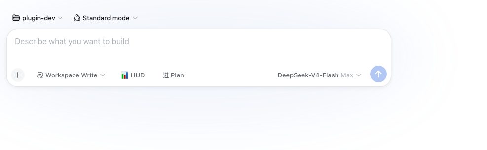

# dsh-plan-switch

[English](README.md) | [简体中文](README.zh-CN.md)


输入框**一键进/出 Plan 模式**的 DSH web 小插件（`/plan` 的快捷点击）。

*非官方项目：社区成员独立开发维护，非 DeepSeek 官方产品。*
## 截图



## 安装

```bash
dsh plugin --profile web add "github:a903067276-rgb/dsh-plan-switch#main"
```

## 用法

输入框工具行左侧的**清单图标按钮**（官方 dsw 设计风格，跟随深浅色主题），点击进入 plan 模式（等同 `/plan`）。plan 模式进行中按钮自动隐藏——状态由官方 Plan 卡片显示，不会出现重复指示。

## 开发

- 源码：`lib/index.js`（server 端）、`lib/client.js`（web 端注入）
- 开发流程：本地改 → push main → `pnpm update` 验证安装

## 平台支持

| 平台 | 状态 |
|---|---|
| macOS | ✅ 全功能实测（开发环境） |
| Linux / Windows | ⚠️ 架构上预期可用（纯前端按钮，无平台依赖），未实测 |
